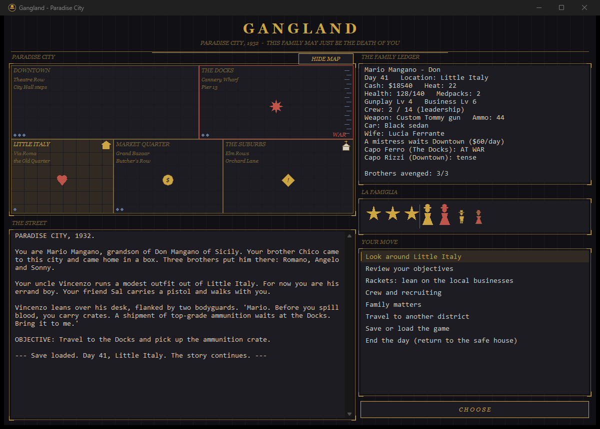

# Gangland (Text Edition)

A single-player, text-driven tribute to MediaMobsters' *Gangland* (2004), written entirely in C against the raw Win32 API. No C runtime, no frameworks, no asset files - just Win32 system DLLs and a ~130 KB native executable.

You are Mario Mangano, sent to Paradise City to avenge your brother Chico by hunting the three brothers who killed him - while building a criminal empire, dodging the Chief of Police, and raising a family that can inherit it all.



## Building

Requires any Visual Studio with the *Desktop development with C++* workload. Either open **`Gangland.sln`** and build (Release | x64), or run the script (`build.bat` locates the toolchain automatically via `vswhere`):

```
build.bat
```

Output: `bin\gangland.exe` (script) or `bin\Release\gangland.exe` (solution). Compiled with `/W4` (clean), optimized for size (`/O1 /Os`), linked with `/NODEFAULTLIB` and a custom entry point in [src/entry.c](src/entry.c) - the C runtime is not used anywhere; `memset`/`memcpy` are provided via compiler intrinsics (`__stosb`/`__movsb`), string formatting comes from `shlwapi`, and the sounds are synthesized in integer math at startup.

## Playing

Run `bin\gangland.exe`. The window is styled after the era - pinstripe-dark, gold art deco, blood-red job markers - with three panes:

- **PARADISE CITY** (top left) - a large collapsible GDI map of the five districts, each with named neighborhoods (Via Roma, Theatre Row, Cannery Wharf, the Grand Bazaar, Orchard Lane...), faint street grids, and harbor water off the Docks. Your location is highlighted, police presence shows as blue pips, your safe house is a gold house icon, the church appears once discovered, and gold squares tally the businesses you control per district (filled = owned, hollow = extorted). Recent happenings are stamped where they happened with drawn icons: a red burst for gunfights, a gold coin for money made, a red warning triangle for kidnappings and lost rackets, a gold diamond for opportunities, and a heart for weddings and births (pings fade after three days). Districts at war with you get a blood-red border and a WAR stamp. The HIDE/SHOW MAP button collapses the tile to give the log the room back.
- **THE STREET** (left) - the narrative log: everything that happens in Paradise City.
- **THE FAMILY LEDGER** (top right) - your status: cash, heat, health, levels, crew, family.
- **LA FAMIGLIA** (middle right) - GDI-drawn rank stars (one per rank: Errand Boy → Capo Soto → Don) and period silhouettes of your household: women in cloche hats and flared dresses (wife in gold, mistress in red), and smaller figures for each heir - an enforcer son in a fedora and suit, lawyer and seductress daughters colored cream and red. Kidnapped family members render as hollow red outlines until you get them back.
- **YOUR MOVE** (bottom right) - your choices. Double-click one (or select it and press **CHOOSE**). Jobs, contracts, and vendetta strikes are marked in red.

## Systems

- **Campaign** - errand boy under Uncle Vincenzo → capo soto → the vendetta against Romano, Angelo, and Sonny, with the mid-game kidnapping of Vincenzo forcing you to rise alone.
- **Districts** - five districts with different police presence; the Suburbs have no law at all, Downtown crawls with it. Heat from crimes scales with local police.
- **Rackets** - extort a business for a daily vig, or seize it outright: more income, but you must keep the manager alive and post guards. Distilleries boost restaurants; restaurants are your recruiting hubs.
- **Crew** - bouncers, gunmen, henchmen, street girls, scouts, snipers, bombers. Units persist, gain experience, level up, and become veterans - and they die for good. Leadership caps your roster.
- **Combat** - turn-resolved. Choose your approach: guns blazing, careful under cover, or send a scout in quietly.
- **The law** - the Chief of Police shakes you down for $3,000 on a schedule. Pay him, bribe the courts through a lawyer heir, or bomb the police station and remove the law from a district entirely.
- **Dynasty** - court a wife at the Downtown social club (dowries run $4,000–$18,000), secure a church in the Suburbs, hold a wedding under armed escort, and raise up to three heirs: enforcer, lawyer, or seductress. The mother's traits bias the child's type and quality - marriage is a gamble. Only blood can lead the family.
- **Courtship** - an evening of wine and dancing ($150, once a day) lowers a bride's asking price. Patience is cheaper than gold, down to a floor of $2,000.
- **Rival capos** - Capo Ferro (Docks), Capo Rizzi (Downtown), and Capo Greco (Market Quarter) each track a grudge against you. Squeezing their districts, bombings, and vendetta kills raise it; at *tense* they lean on your rackets and come up in conversation, at *war* their soldiers storm your safe house by name and their district turns red on the map. Cool it with a paid sit-down, or settle it permanently by hitting the capo himself - the survivors take note.
- **District opportunities** - one-off events with a two-day window: sponsor the Feast of San Gennaro, work a society gala, hijack a freighter, back a side in a vendor war, buy out a moonshiner. Each district's opportunity fits its character.
- **Succession** - if the boss dies with an heir alive, the heir picks up the rings, the ledger, and the vendetta as Generation 2 (some of the crew won't serve a new name). No heir, no family: game over.
- **The family underworld** - keep a mistress Downtown (she hears everything; your wife hears eventually - suspicion, a kitchen-table confrontation, and three bad ways out). Your in-laws run a business: shield them for free or squeeze them for tribute and eat dinner in silence. Rivals kidnap wives and heirs - pay the ransom or send a scout to find the hideout and take them back with guns. A scorned wife sells your routes to rivals on her way out the door.
- **Vehicles** - steal a jalopy or buy a sedan (fewer travel ambushes, drive-by openings) or an armored sedan.
- **Ammo** - every fighter burns a shell per fight; run dry and the whole crew shoots worse. Buy crates at the dealer or control the ammo store for daily supply.
- **Specialists** - a squad sniper opens every fight with a free rooftop kill; a bomber can level a business, terrorizing the district into paying protection without a fight for days.
- **Information** - the newspaper man sells intel Downtown; rats call the safe-house phone with tips, unit offers, and contract hits; a mistress leaks rival locations between cigarettes. Watch for informants in your own crew when the heat climbs.
- **Sound** - procedurally synthesized period effects (tommy-gun bursts, wedding bells, a dirge, a fanfare) generated in memory at startup; toggle in the save menu.
- **Rival hideouts** - each rival district hides a hoodlum den. Case it with a scout to learn the guard count (or go in blind against extra guns), clean it out for cash and ammunition, and come back in a week when new faces move in.
- **Crew armament** - the dealer sells crew Tommy guns ($600 a man, +1 attack). Armed men show `[Tommy]` on the roster.
- **The corner racket** - street girls can work a corner for steady daily cash with steady consequences: beat-cop shakedowns, heat, and the occasional bad customer.
- **Upbringing** - heirs kept at home can be tutored ($200, once a day) to raise their quality: boxing coaches for enforcers, disbarred judges for lawyers, retired opera singers for seductresses.
- **Vincenzo's fate** - after Angelo falls, listen for word of an old man kept in a basement off Pier 13. Bring him home and the family stipend returns, doubled.
- **Your Legend** - a running tally of the life: enemies buried, men lost, fights, businesses, capos, ransoms, generations.
- **Field medpacks** - the boss automatically tears one open mid-fight when badly hit.
- **Save anywhere** - three named slots (each shows day, rank, and cash), plus an automatic dawn autosave every morning. This family learned from 1932's mistakes.

## Source layout

| File | Contents |
| --- | --- |
| `Gangland.sln` / `Gangland.vcxproj` | Visual Studio solution (Debug and Release, x64) |
| `src/gangland.h` | Shared types and constants (each module's API lives in its matching `.h`) |
| `src/entry.c` | The no-CRT entry point (`WinMainCRTStartup`), nothing else |
| `src/util.c` | Heap helpers, RNG, no-CRT `memset`/`memcpy` |
| `src/main.c` | Window, controls, map/family painting, log/choice plumbing |
| `src/world.c` | Game state, data tables, day cycle, events, save/load (loads are sanitized: every index clamped, every string terminated) |
| `src/menu.c` | Choice-list construction for every screen |
| `src/actions.c` | Handlers for every player action |
| `src/combat.c` | Battle engine, raids, mission outcomes, succession |
| `src/sound.c` | Procedural WAV synthesis (no assets, no floats) |
| `res/gangland.rc` + `res/gangland.ico` | Embedded fedora-badge application icon |
| `tools/make_icon.ps1` | Regenerates the icon from code (System.Drawing) |
| `tools/make_testsave.c` | Dev tool: writes crafted save files for testing scenarios |
| `gangland_features.md` | The design reference the game was built from |

The dark theme is pure GDI: owner-drawn list and button, custom-painted banner and pane frames, `DwmSetWindowAttribute` for the dark title bar, and `SetWindowTheme("DarkMode_Explorer")` for dark scrollbars (adds `dwmapi` and `uxtheme` to the import list).

## Disclaimer

This is an unofficial fan project inspired by *Gangland* (2004) by MediaMobsters / Whiptail Interactive. It is not affiliated with, endorsed by, or connected to the original developers or publishers. All game code and art here are original; the design document describes the original game for reference purposes.
